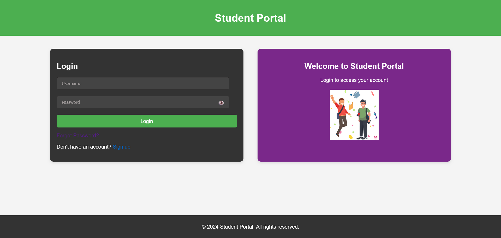
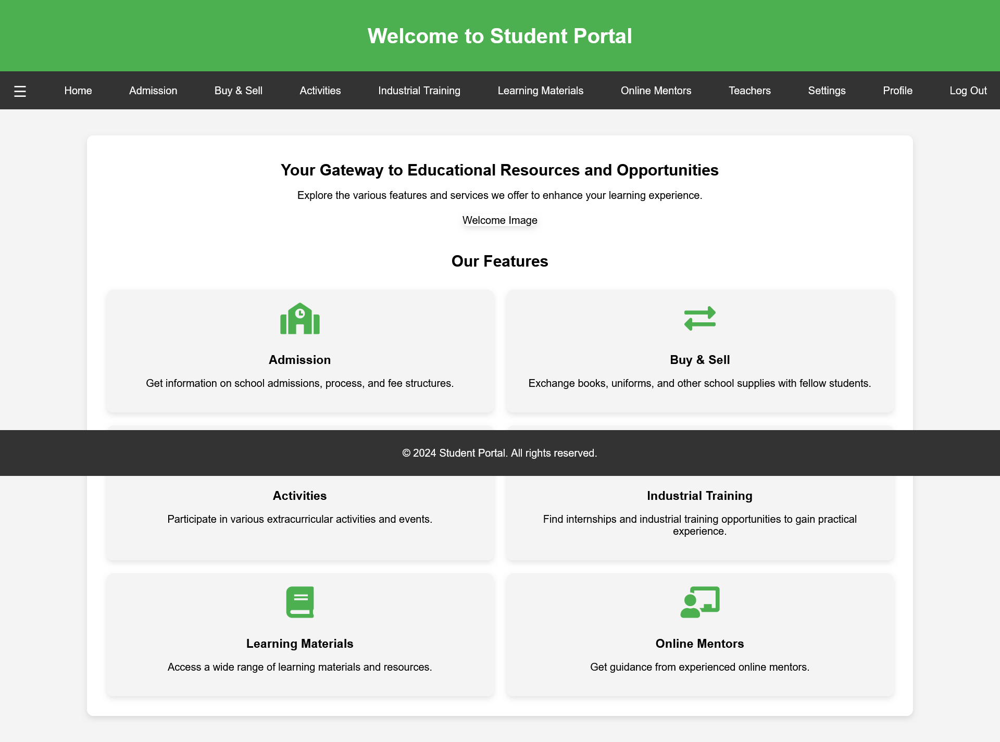
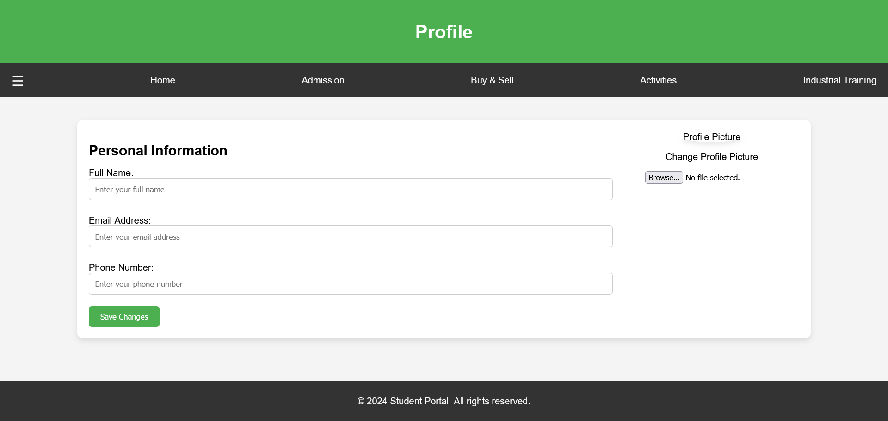

# Intel Project Integrated-common-Services-to-Common-people
This repository is part of the Intel Unnati Industrial Training Program 2024. To create an accessible and unified platform that offers a wide range of educational resources and services to students, teachers, and the general public.

## Table of Contents
1. [Introduction](#introduction)
2. [Project Workflow](#project-workflow)
3. [Features](#features)
4. [Installation](#installation)
5. [Result](#result)
6. [Benefits](#benefits)
7. [Contributing](#contributing)
8. [License](#license)


# Introduction
This project aims to create an accessible and unified platform that provides a comprehensive range of educational resources and services. Our goal is to support students, teachers, and the general public by offering valuable tools and materials that enhance learning and teaching experiences. Through this platform, we strive to foster an inclusive educational environment that empowers individuals to acquire new skills and knowledge.

# Project Workflow
The overall workflow of the project as follows:

**1. Login Page:** User authentication interface to access the portal.

**2. Homepage:** Central dashboard with navigation links to various sections.

**3. Navigation Bar:** Menu for easy access to different sections of the portal.

**4. Admission:** Section for viewing and applying for admission programs.

**5. Buy & Sell:** Platform for buying and selling books, supplies, and more.

**6. Activities:** Area for viewing and participating in extracurricular activities.

**7. Industrial Training:** Section to find and apply for industrial training opportunities.

**8. Learning Materials:** Repository for accessing and downloading educational resources.

**9. Online Mentors:** Platform to browse and contact online mentors.

**10. Teachers:** Directory of teacher profiles with contact and interaction options.

**11. Settings:** User interface for updating profile settings and preferences.

**12. Profile:** User profile management with options to update personal information.

**13. Database:** Backend component for storing and retrieving user and application data.

**14. Confirmation Page:** Feedback interface confirming successful actions and updates.


# Features:
**Learning Materials and Mentorship:**
1. Access to diverse learning materials.
2. Connect with online mentors for guidance.
3. School Information and Admissions:


**Detailed school profiles.**
1. Admission processes and fee structures.


**Affordable Learning Materials:**
1. Marketplace for second-hand and reusable learning materials, including laptops.


**Industry Training and Job Assistance:**
1. Information on industry training programs.
2. Job aid centers to support employment opportunities.

## Installation

To clone and run this repository locally, follow these steps:

1. Clone the repository using Git:
   ```bash
   git clone https://github.com/Shravansrk-create/Integrated-common-Services-to-Common-people.git

2. Express:
   ```bash
   npm install express

3. Mongoose:
   ```bash
   npm install mongoose

4. Body-parser:
   ```bash
   npm install body-parser

5. Cors:
   ```bash
   npm install cors

6. Dotenv:
   ```bash
   npm install dotenv

## Result

Our integrated platform for common services delivers a comprehensive and user-friendly experience for students, teachers, and the general public. Key results include:

- **Enhanced Learning Experience:**
  - Users have access to a wide range of educational resources and materials, enriching their learning journey.

- **Seamless Navigation:**
  - Intuitive navigation ensures users can easily access all sections and features of the platform.

- **Efficient Profile Management:**
  - Users can effortlessly manage and update their profiles, ensuring their information is always current.

- **Improved Interaction:**
  - Students can connect with online mentors and teachers for personalized guidance and support, fostering a collaborative learning environment.

- **Easy Admission Process:**
  - The admission process for various programs is streamlined, making it simple for users to view and apply for opportunities.

- **Secure Marketplace:**
  - The Buy & Sell section provides a secure platform for users to exchange books, supplies, and other educational materials.

- **Comprehensive Activity Participation:**
  - Users can easily view and participate in various extracurricular activities, enhancing their overall educational experience.

- **Industrial Training Opportunities:**
  - The platform offers information and application processes for industrial training programs, supporting skill development and career advancement.

- **Responsive Design:**
  - The application is fully responsive, providing an optimal user experience across desktops, tablets, and smartphones.

### Screenshots


Login Page


Homepage


Profile Page

### User Feedback

- "The platform is incredibly easy to navigate and has greatly enhanced my learning experience." - Student A
- "Connecting with mentors and accessing resources has been a game-changer for my studies." - Student B
- "The responsive design makes it convenient to access the platform on my phone." - Student C


# Benefits:
. Centralized access to educational resources.
. Cost-effective solutions for learning materials.
. Enhanced opportunities for skill development and employment.
**This application is designed to bridge the gap between educational needs and available resources, making learning more accessible and affordable for everyone**

# Contributing
Contributions are welcome! Whether you want to submit a bug report, suggest a feature, or contribute code, we are grateful for your help.

**Fork the Repository:**
1.   Click the "Fork" button at the top-right corner of this repository's page to create your own copy of the repository.

# License

This project is licensed under the MIT License. See the [LICENSE] file for more details.
